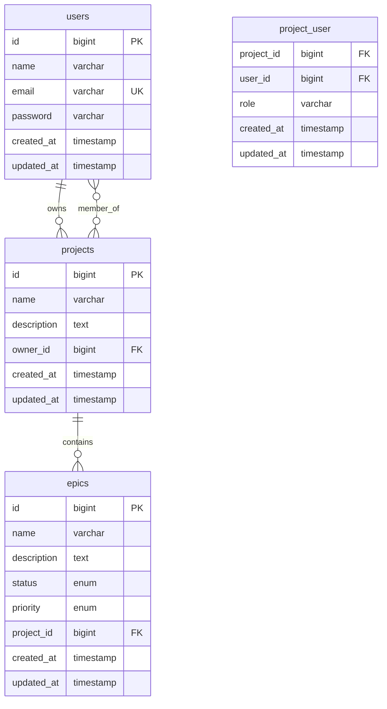

# SGP Lite - Sistema de Gestão de Projetos

Uma aplicação web para gerir projetos, épicos, features/tarefas e equipes, com board por status (Backlog, Doing, Done), permissões por projeto (dono, membro), comentários e anexos. Foco inicial: colaboração ágil para equipes pequenas.

## 🚀 Sprint 1 - MVP Core (Concluída)

### ✅ Funcionalidades Implementadas

- **Autenticação completa** (registro/login) com Laravel Breeze
- **CRUD de Projetos** com gerenciamento de membros
- **Sistema de permissões** (dono x membro)
- **Interface responsiva** com templates Blade e TailwindCSS
- **Testes automatizados** para todas as funcionalidades
- **Docker** configurado para desenvolvimento

</div>

---

## 📋 Sobre o Projeto

O **SGP Lite** é um sistema completo de gestão de projetos desenvolvido com foco na simplicidade e produtividade. Projetado para equipes ágeis que precisam de uma ferramenta moderna, intuitiva e poderosa para organizar seus projetos, épicos e tarefas.

### ✨ Destaques

- 🎨 **Interface Moderna** - Design app-like com Bootstrap 5
- 🔐 **Sistema Completo de Autenticação** - Registro, login e permissões
- 📊 **Dashboard Interativo** - Métricas e gráficos em tempo real
- 🎯 **Gestão de Épicos** - Organize funcionalidades por prioridade e status
- 👥 **Colaboração em Equipe** - Sistema de membros e permissões
- 📱 **Totalmente Responsivo** - Funciona perfeitamente em todos os dispositivos
- 🧪 **100% Testado** - Cobertura completa de testes automatizados

---

## 🚀 Funcionalidades por Sprint

### 🏆 Sprint 1 - Fundação (Concluída ✅)
- ✅ **Autenticação Completa** - Registro, login, logout com validações
- ✅ **CRUD de Projetos** - Criar, visualizar, editar e excluir projetos
- ✅ **Sistema de Permissões** - Donos e membros com diferentes acessos
- ✅ **Gerenciamento de Equipe** - Adicionar/remover membros dos projetos
- ✅ **Interface Bootstrap** - Design responsivo e moderno
- ✅ **Testes Automatizados** - Cobertura completa com PHPUnit

### 🎯 Sprint 2 - Épicos (Concluída ✅)
- ✅ **CRUD Completo de Épicos** - Gestão completa de épicos por projeto
- ✅ **Sistema de Status** - Backlog → Em Progresso → Concluído
- ✅ **Sistema de Prioridades** - Baixa, Média, Alta com cores visuais
- ✅ **Relacionamentos Avançados** - Projetos ↔ Épicos bem estruturados
- ✅ **Políticas de Autorização** - Controle fino de permissões
- ✅ **Testes de Feature** - Testes completos de funcionalidades
- ✅ **Seeders e Factories** - Dados de exemplo para desenvolvimento

### 🎨 Sprint 2.5 - Interface Moderna (Concluída ✅)
- ✅ **Design System Completo** - Paleta de cores, tipografia e componentes
- ✅ **Layout App-like** - Sidebar, navbar e footer modernos
- ✅ **Dashboard Interativo** - Cards de métricas e gráficos Chart.js
- ✅ **Board Kanban** - Drag & drop com SortableJS
- ✅ **Tema Escuro/Claro** - Toggle de temas com localStorage
- ✅ **Páginas de Auth Modernizadas** - Login e registro redesenhados
- ✅ **Responsividade Total** - Mobile-first com breakpoints otimizados
- ✅ **Acessibilidade WCAG AA** - Contraste, ARIA labels e navegação por teclado

### 🔄 Sprint 3 - Tasks & Features (Próxima)
- [ ] **CRUD de Tasks** - Tarefas individuais dentro dos épicos
- [ ] **Board Kanban Funcional** - Drag & drop com persistência no backend
- [ ] **Sistema de Comentários** - Discussões em épicos e tasks
- [ ] **Notificações** - Sistema de notificações em tempo real
- [ ] **Filtros Avançados** - Busca e filtros por status, prioridade, responsável
- [ ] **Timeline de Atividades** - Histórico de mudanças

### 🚀 Sprint 4 - Analytics & API (Futura)
- [ ] **Dashboard Avançado** - Métricas detalhadas e KPIs
- [ ] **Relatórios Exportáveis** - PDF e Excel com dados do projeto
- [ ] **API REST Completa** - Endpoints para integração externa
- [ ] **Webhooks** - Integração com Slack, Discord, etc.
- [ ] **Backup Automático** - Sistema de backup e restore
- [ ] **Multi-tenancy** - Suporte a múltiplas organizações

---

## 🛠️ Stack Tecnológica

### Backend
- **Laravel 9.x** - Framework PHP robusto e elegante
- **MySQL 8.0** - Banco de dados relacional
- **PHP 8.1+** - Linguagem de programação moderna

### Frontend
- **Bootstrap 5** - Framework CSS responsivo
- **Chart.js** - Gráficos interativos
- **SortableJS** - Drag & drop para Kanban
- **Bootstrap Icons** - Ícones modernos e consistentes

### Desenvolvimento
- **Laravel Mix** - Build tool para assets
- **PHPUnit** - Framework de testes
- **Laravel Factories** - Geração de dados de teste
- **Docker** - Containerização (opcional)

---

## 📊 Arquitetura do Banco



---

## 🚀 Instalação e Configuração

### Pré-requisitos
- PHP 8.1 ou superior
- Composer
- Node.js 16+ e NPM
- MySQL 8.0 ou superior

### 1. Clone o Repositório
```bash
git clone https://github.com/davif12/SGP---lite.git
cd SGP---lite
```

### 2. Instale as Dependências
```bash
# Backend
composer install

# Frontend
npm install
```

### 3. Configuração do Ambiente
```bash
# Copie o arquivo de exemplo
cp .env.example .env

# Gere a chave da aplicação
php artisan key:generate
```

### 4. Configure o Banco de Dados
Edite o arquivo `.env` com suas credenciais:
```env
DB_CONNECTION=mysql
DB_HOST=127.0.0.1
DB_PORT=3306
DB_DATABASE=sgp_lite
DB_USERNAME=seu_usuario
DB_PASSWORD=sua_senha
```

### 5. Execute as Migrações
```bash
# Criar tabelas e popular com dados de exemplo
php artisan migrate --seed
docker-compose exec laravel.test php artisan db:seed
```

### 6. Compile os assets
```bash
docker-compose exec laravel.test npm run dev
```

## 🌐 Acesso à Aplicação

- **URL**: http://localhost
- **Usuário de teste**: davi@teste.com
- **Senha**: password

## 🧪 Executando Testes

```bash
docker-compose exec laravel.test php artisan test
```

## 📁 Estrutura do Projeto

```
app/
├── Http/Controllers/
│   └── ProjectController.php
├── Models/
│   ├── User.php
│   └── Project.php
└── Policies/
    └── ProjectPolicy.php

database/
├── migrations/
│   ├── create_projects_table.php
│   └── create_project_user_table.php
├── factories/
│   └── ProjectFactory.php
└── seeders/
    ├── DatabaseSeeder.php
    └── ProjectSeeder.php

resources/views/projects/
├── index.blade.php
├── create.blade.php
├── show.blade.php
└── edit.blade.php

tests/Feature/
└── ProjectTest.php
```

## 🔐 Sistema de Permissões

### Papéis de Usuário
- **Owner (Dono)**: Pode editar, excluir projeto e gerenciar membros
- **Member (Membro)**: Pode visualizar o projeto

### Regras de Acesso
- Apenas membros do projeto podem visualizá-lo
- Apenas o dono pode editar/excluir o projeto
- Apenas o dono pode adicionar/remover membros

## 🗄️ Schema do Banco de Dados

### Tabela `projects`
- `id` - Primary Key
- `name` - Nome do projeto
- `description` - Descrição (opcional)
- `owner_id` - Foreign Key para users
- `created_at`, `updated_at` - Timestamps

### Tabela `project_user` (Pivot)
- `id` - Primary Key
- `project_id` - Foreign Key para projects
- `user_id` - Foreign Key para users
- `role` - Enum ('owner', 'member')
- `created_at`, `updated_at` - Timestamps

### Tabela `epics`
- `id` - Primary Key
- `name` - Nome do épico
- `description` - Descrição (opcional)
- `status` - Enum ('backlog', 'in_progress', 'done')
- `priority` - Enum ('low', 'medium', 'high')
- `project_id` - Foreign Key para projects
- `created_at`, `updated_at` - Timestamps

## 🔄 Próximas Sprints

### Sprint 3 (Planejada)
- CRUD de Tasks/Features
- Board Kanban básico
- Sistema de status para tasks

### Sprint 4 (Planejada)
- Comentários em tarefas
- Sistema de anexos
- Notificações por email

### Sprint 5 (Planejada)
- Dashboard com métricas
- Relatórios de produtividade
- API REST básica

## 🤝 Metodologia Scrum

Este projeto segue a metodologia Scrum com:
- **Sprints de 2 semanas**
- **Definition of Done** rigorosa
- **Testes automatizados** obrigatórios
- **Code Review** via Pull Requests

## 📝 Comandos Úteis

```bash
# Executar migrations
docker-compose exec laravel.test php artisan migrate

# Executar seeders
docker-compose exec laravel.test php artisan db:seed

# Limpar cache
docker-compose exec laravel.test php artisan cache:clear

# Executar testes
docker-compose exec laravel.test php artisan test

# Acessar container
docker-compose exec laravel.test bash
```

## 📄 Licença

Este projeto está licenciado sob a [MIT License](https://opensource.org/licenses/MIT).
